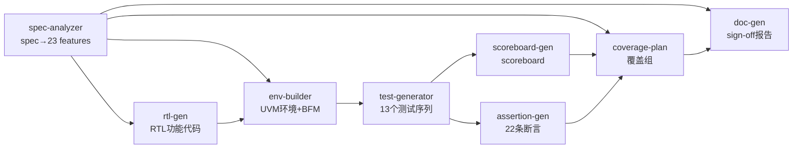

# Digital Verify Pro — Pipeline State Machine

```mermaid
stateDiagram-v2
    [*] --> SPEC_READY: inputspec.yml

    state SPEC_READY {
        [*] --> ParseSpec
        ParseSpec --> ValidateSpec
        ValidateSpec --> [*] : validation PASS
        ValidateSpec --> ParseSpec : validation FAIL (exit)
    }

    SPEC_READY --> RTL_GEN : .contract_spec-analyzer.json
    SPEC_READY --> ENV_BUILD : .contract_spec-analyzer.json
    SPEC_READY --> COVERAGE_PLAN : .contract_spec-analyzer.json
    SPEC_READY --> SW_HEADER_GEN : .contract_spec-analyzer.json
    SPEC_READY --> DOC_GEN : .contract_spec-analyzer.json

    state RTL_GEN {
        [*] --> GenerateTop
        GenerateTop --> GenerateRegBank
        GenerateRegBank --> GenerateIRQ
        GenerateIRQ --> [*]
    }

    RTL_GEN --> ENV_BUILD : rtl/rtl/

    state ENV_BUILD {
        [*] --> GenInterfaces
        GenInterfaces --> GenAgents
        GenAgents --> GenBFM
        GenBFM --> GenEnv
        GenEnv --> GenTBTop
        GenTBTop --> GenSequences
        GenSequences --> GenScoreboard
        GenScoreboard --> GenAssertions
        GenAssertions --> GenCoverage
        GenCoverage --> ValidateEnv
        ValidateEnv --> [*] : PASS
        ValidateEnv --> GenInterfaces : FAIL (fix + regenerate)
    }

    ENV_BUILD --> TEST_GEN : .contract_env-builder.json

    state TEST_GEN {
        [*] --> ParseAPBSteps
        ParseAPBSteps --> CheckBFMNeed
        CheckBFMNeed --> GenSequenceBody_APBOnly : no BFM needed
        CheckBFMNeed --> GenSequenceBody_WithBFM : BFM needed
        GenSequenceBody_APBOnly --> GenRegressionTest
        GenSequenceBody_WithBFM --> GenRegressionTest
        GenRegressionTest --> ValidateSeqs
        ValidateSeqs --> [*] : PASS
        ValidateSeqs --> ParseAPBSteps : FAIL (exit)
    }

    TEST_GEN --> ASSERTION_GEN : .contract_test-generator.json
    TEST_GEN --> SCOREBOARD_GEN : 13 test scenarios

    state ASSERTION_GEN {
        [*] --> GenAPBAssert
        GenAPBAssert --> GenRegAssert
        GenRegAssert --> GenResetAssert
        GenResetAssert --> ValidateAsserts
        ValidateAsserts --> [*] : PASS
        ValidateAsserts --> GenAPBAssert : FAIL (exit)
    }

    ASSERTION_GEN --> COVERAGE_PLAN : .contract_assertion-gen.json

    state SCOREBOARD_GEN {
        [*] --> GenScoreboard
        GenScoreboard --> ValidateSb
        ValidateSb --> [*]
    }

    SCOREBOARD_GEN --> COVERAGE_PLAN : sb ready

    state COVERAGE_PLAN {
        [*] --> ReadSpecCoverageGoals
        ReadSpecCoverageGoals --> GenCovergroups
        GenCovergroups --> TraceCoverageAgainstSpec
        TraceCoverageAgainstSpec --> CheckGaps
        CheckGaps --> ValidateCov
        ValidateCov --> [*] : PASS (w/ warnings)
        ValidateCov --> GenCovergroups : FAIL (exit)
    }

    COVERAGE_PLAN --> DOC_GEN : .contract_coverage-plan.json

    state DOC_GEN {
        [*] --> CountGeneratedFiles
        CountGeneratedFiles --> CheckContractExistence
        CheckContractExistence --> GenerateReport
        GenerateReport --> ValidateDoc
        ValidateDoc --> [*] : PASS
        ValidateDoc --> GenerateReport : FAIL (exit)
    }

    DOC_GEN --> SW_HEADER_GEN : .contract_doc-gen.json

    state SW_HEADER_GEN {
        [*] --> GenerateHeader
        GenerateHeader --> ValidateHeader
        ValidateHeader --> [*] : PASS
        ValidateHeader --> GenerateHeader : FAIL (exit)
    }

    SW_HEADER_GEN --> [*] : sw/<module>.h

    note right of SPEC_READY
        提取23个feature:
        - 模块名/接口/时钟/复位
        - 17个寄存器/34个field
        - 13个测试场景
        - 3个地址空洞
        - 16个覆盖目标
    end note

    note right of RTL_GEN
        输出: 3个RTL模块
        - pl061_gpio.sv (顶层)
        - pl061_gpio_regs.sv (寄存器堆)
        - pl061_gpio_irq.sv (中断控制器)
        APB译码+GPIO双向pad
    end note

    note right of ENV_BUILD
        输出: 14+个SV文件
        - interfaces (apb/gpio/intr)
        - agents (driver/monitor/seq)
        - BFM (gpio_bfm)
        - env / tb_top / pkg
    end note

    note right of TEST_GEN
        输出: 13个序列 + regression
        - 解析spec步骤→APB调用
        - 中断测试→加入BFM驱动
        - 纯APB测试→寄存器RW
        74条randomize命令, 0 TODO
    end note

    note right of ASSERTION_GEN
        输出: 3个断言模块
        - APB协议8条
        - 地址空洞3条PSLVERR
    end note

    note right of SCOREBOARD_GEN
        输出: 1个scoreboard
        APB事务监控
    end note

    note right of COVERAGE_PLAN
        输出: 1个covergroup模块
        - APB事务类型交叉
        - 寄存器地址范围
        - 16目标→WARNING检查
    end note

    note right of DOC_GEN
        输出: verification-close-report.md
        统计所有生成文件
        验证contract完整性
    end note
```



## Phase Dependency Graph



## Validation Gates

```
Phase            →  Validator                                      →  Contract .json
────────────────────────────────────────────────────────────────────────────────
spec-analyzer    → validate_spec_analyzer(): 检查输出文件、寄存器访问类型、traceability  → .contract_spec-analyzer.json
rtl-gen         → (无 validator, 轻量)                                                  → (无, 文件自含)
env-builder     → validate_env_builder(): 接口 clocking/modport、连接完整性、bidir pullup → .contract_env-builder.json
test-generator  → validate_test_generator(): 变量重复声明、RO写入检查                  → .contract_test-generator.json
assertion-gen   → validate_assertion_gen(): assert property 数量                      → .contract_assertion-gen.json
scoreboard-gen  → validate_scoreboard_gen(): report_phase、uvm_analysis_imp            → .contract_scoreboard-gen.json
coverage-plan   → validate_coverage_plan(): 16目标 vs covergroup traceability          → .contract_coverage-plan.json
doc-gen         → validate_doc_gen(): 6个contract文件完整性                            → (最终)
```

## Data Flow

```
spec.yml
  │
  ▼
build_spec_data()
  │
  ├── module_name, module_desc             → 所有模板
  ├── clk_name, rst_name, rst_polarity     → rtl-gen, env-builder
  ├── interfaces (apb, protocol, interrupt) → env-builder (选模板)
  ├── registers (17)                       → rtl-gen, test-generator
  │   └── reg_fields_detail (34 fields)    → rtl-gen (复位值)
  ├── test_scenarios (13)                  → test-generator
  │   └── [i].apb_steps (74 steps)         → 序列体生成
  ├── reg_addr_map                         → test-generator (地址)
  ├── reserved_ranges (3)                  → assertion-gen (PSLVERR)
  ├── coverage_goals (16+4)                → coverage-plan (trace)
  └── .contract_*.json                     → inter-phase契约
```

## Run Output Example (ARM PL061 GPIO)

```
8 phases, 2.8s, 100% pass

Architect:
  3 interfaces, 17 registers, 34 fields, 13 scenarios
  Address holes: 3 (total 1240 bytes reserved)

RTL:
  3 modules: top + regs + irq
  Register reset values: 1 non-zero (GPIODR2R=0xFF)

UVM Environment:
  33 SV files: 3 if + 5 agent + 16 seq + 3 asrt + 1 sb + 1 cov + 1 bfm + sim/Makefile + tests/pkg/tb_top
  74 APB randomize commands, 0 TODOs
  8 APB assertions + 3 PSLVERR assertions
  1 scoreboard, 1 coverage module

Doc: verification-close-report.md generated
```
